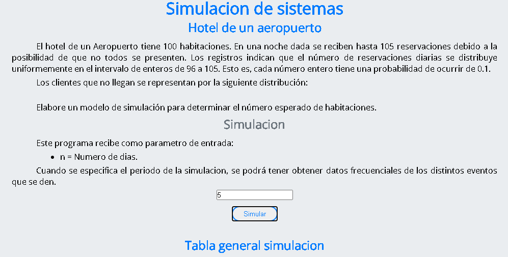

# Universidad Nacional Abierta - Simulacion de sistemas 337
This is a page that simulates the room reservations of an airport hotel. Destined to solve a university exercise for the subject 337 Simulation of systems.

## Table of contents

- [Overview](#overview)
  - [The challenge](#the-challenge)
  - [Screenshot](#screenshot)
  - [Links](#links)
- [My process](#my-process)
  - [Built with](#built-with)
  - [What I learned](#what-i-learned)
  - [Continued development](#continued-development)
  - [Useful resources](#useful-resources)
- [Author](#author)
- [Acknowledgments](#acknowledgments)

**Note: Delete this note and update the table of contents based on what sections you keep.**

## Overview

### The challenge

Users should be able to:

- View the optimal layout for the component depending on their device's screen size
- See hover states for all interactive elements on the page
- Hide/Show the answer to a question when the question is clicked

### Screenshot

### Links

- Solution URL: [Ver solucion](https://github.com/samuelpklm/samuelpklm.github.io-Simulacion_de_sistemas_337)
- Live Site URL: [Ver Pagina](https://samuelpklm.github.io/samuelpklm.github.io-Simulacion_de_sistemas_337/)

## My process

### Built with

- Semantic HTML5 markup
- CSS custom properties
- Flexbox
- CSS Grid
- Mobile-first workflow
-Jquery

### What I learned

I learned how to use the html table tag for data presentation.

### Useful resources

- [Example Runge-Kutta js](https://tabthemes.com/es/30-free-css3-html-table-templates-2022/) - Good reference material for creating templates.

## Author

- Website - [Samuel Rodriguez](https://github.com/samuelpklm)
- Frontend Mentor - [@samuelpklm](https://www.frontendmentor.io/profile/samuelpklm)
- Email - [@Samuel Rodriguez](samuelr76@gmail.com)
